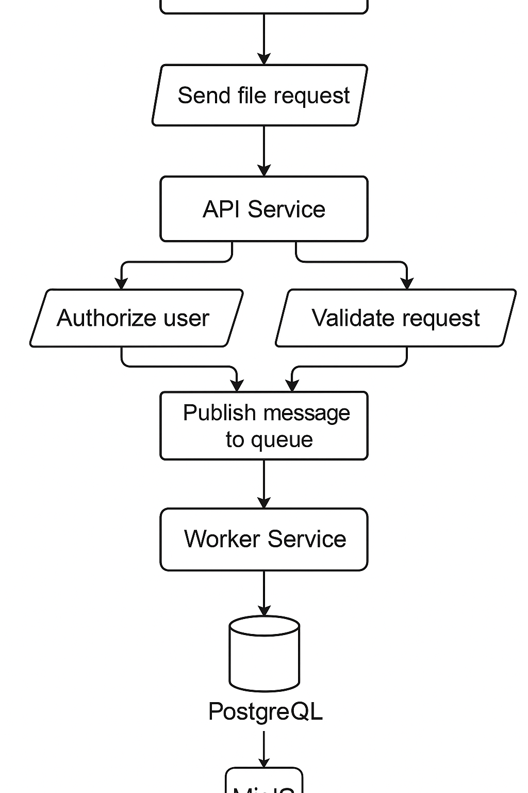

# 📦 Secure Media Vault API

Secure Media Vault is a modern and secure file management platform built with Kotlin, Spring Boot 3, and reactive microservices. It supports uploading, processing, downloading, and listing files asynchronously using RabbitMQ and MinIO.

---

## 🚀 Key Features

- 🔐 JWT-based authentication and role-based access control.
- 📤 Asynchronous file upload and processing with Worker module.
- ☁️ MinIO-based object storage for secure file handling.
- 🐇 RabbitMQ for asynchronous communication between modules.
- 🧩 PostgreSQL for metadata and user information storage.
- ⚡ Reactive API built with Spring WebFlux.
- 🔄 Redis for caching and session control.
- 📄 Swagger/OpenAPI 3 for API documentation.
- ✅ Unit tests using JUnit 5 and  MockKs.

---

## ⚙️ System Architecture
> 

---

## 🧪 Testing Stack

This project has comprehensive unit testing for authentication and service logic, including:

| Tool             | Purpose                              |
|------------------|--------------------------------------|
| **JUnit 5**       | Test runner framework                |
| **MockK**         | Kotlin mocking framework             |
| **Spring Test**   | Integration and reactive testing     |
| **Testcontainers**| Spin up PostgreSQL and MinIO in Docker for isolated tests |

All tests are located under `src/test/kotlin`.

---

## 🛠️ Tech Stack

| Layer             | Technology                          |
|------------------|--------------------------------------|
| Language          | Kotlin (JVM 17)                      |
| API Layer         | Spring Boot 3 + WebFlux              |
| Auth              | JWT + Spring Security                |
| Object Storage    | MinIO (S3 compatible)                |
| Asynchronous Comm.| RabbitMQ                            |
| Data Persistence  | PostgreSQL + R2DBC                   |
| Caching           | Redis (reactive)                     |
| Documentation     | SpringDoc OpenAPI UI                 |
| Containerization  | Docker Compose                      |

---

## 🗂️ Project Structure

```bash
secure-media-vault/
├── api/               # REST API module (uploads, downloads, auth)
├── worker/            # Worker module (listens to queue, processes files)
├── shared/            # Shared DTOs and configs
├── docker-compose.yml # Orchestration file
├── docs/              # Documentation and diagrams
└── README.md          # You're here!
```

---

## 🔐 Authentication

- All endpoints (except `/auth/login`, `/auth/register`) are secured.
- JWT tokens must be sent via the `Authorization: Bearer <token>` header.
- Roles: `ROLE_USER`, with potential for `ROLE_ADMIN` extension.

---

## 📂 API Endpoints

| Endpoint                       | Method | Description                          | Auth |
|-------------------------------|--------|--------------------------------------|------|
| `/auth/register`              | POST   | Register a new user                  | ❌    |
| `/auth/login`                 | POST   | Login and get JWT tokens             | ❌    |
| `/auth/refresh`               | POST   | Refresh access token                 | ✅    |
| `/files/upload`               | POST   | Upload a file                        | ✅    |
| `/files/download/{filename}`  | GET    | Download file by name                | ✅    |
| `/files/list`                 | GET    | List all uploaded files              | ✅    |
| `/files/delete/{filename}`    | DELETE | Delete a file from storage           | ✅    |

> Full Swagger UI available at: `http://localhost:8081/swagger-ui.html`

---

## 🐳 How to Run with Docker

```bash
docker-compose up --build
```

The system will start:
- PostgreSQL on port `5432`
- RabbitMQ on port `5672` and management UI on `15672`
- Redis on port `6379`
- MinIO on http://localhost:9400/browser/media
- API service on `8080`
- Worker service on `8082`

---

## 👨‍💻 Author

**Armando Haro**  
📧 [armando_haro1@hotmail.com](mailto:armando_haro1@hotmail.com)

---

## 📊 System Flow Diagram



---
